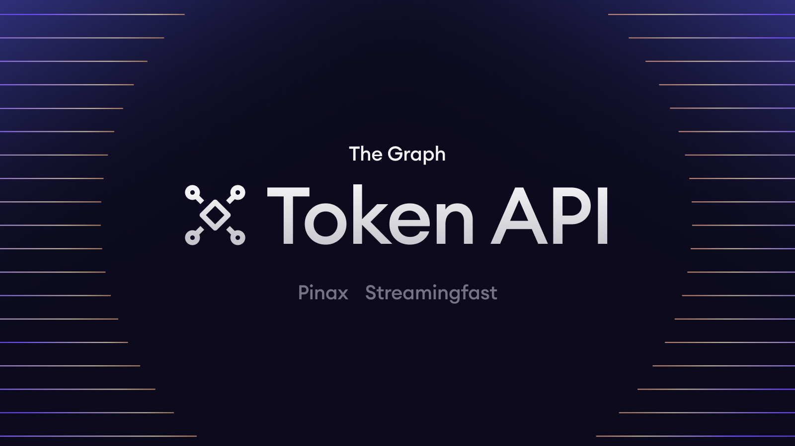
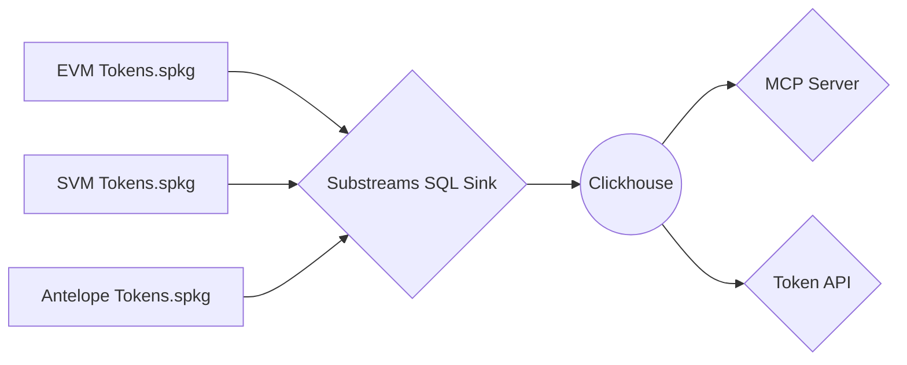

# The Graph: `Token API`

[](https://github.com/graphprotocol/token-api/actions/workflows/bun-test.yml)


> Power your apps with real-time token data.



## Architecture



## Supported Endpoints

- [x] Balances
- [x] Holders
- [x] Tokens
- [x] Transfers

## Supported Networks

- [x] EVM (Ethereum, Base, Arbitrum, BSC, etc.)
- [ ] SVN (Solana)
- [ ] Antelope (Vaulta, WAX, Telos, Ultra)

## `.env` Environment variables

```env
# API Server
PORT=8000
HOSTNAME=localhost

# MCP Server
SSE_PORT=8080
SSE_ENDPOINT=sse

# Clickhouse Database
URL=http://127.0.0.1:8123
DATABASE=default
USERNAME=default
PASSWORD=
MAX_LIMIT=10000

# Logging
PRETTY_LOGGING=true
VERBOSE=true
```

## Docker environment

- Pull from GitHub Container registry

**For latest tagged release**

```bash
docker pull ghcr.io/graphprotocol/token-api:latest
```

**For head of `main` branch**

```bash
docker pull ghcr.io/graphprotocol/token-api:develop
```

- Build from source

```bash
docker build \
  --build-arg GIT_COMMIT="$(git rev-parse HEAD)" \
  -t token-api .
```

- Run with `.env` file

```bash
docker run -it --rm --env-file .env -p 8000:8000 ghcr.io/graphprotocol/token-api:develop
```

## Contributing

See [`CONTRIBUTING.md`](CONTRIBUTING.md).

### Quick start

Install [Bun](https://bun.sh/)

```bash
bun install
bun dev
```

**Tests**

```bash
bun lint
bun test
```
