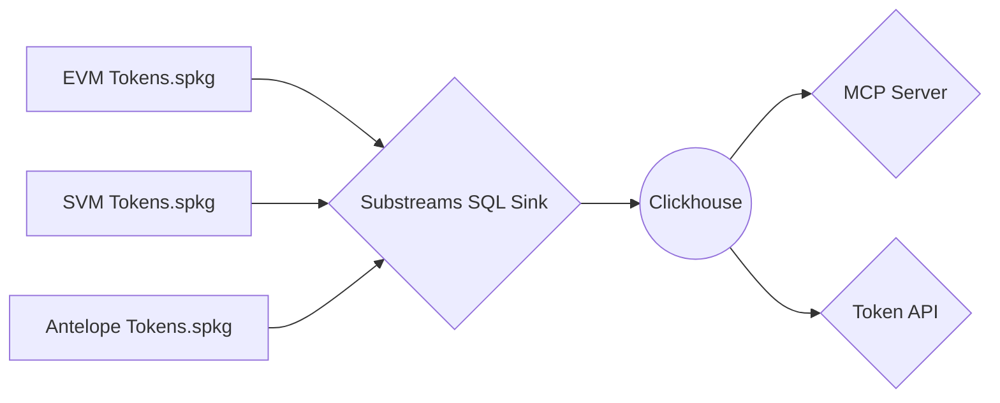

# The Graph: `Token API`

[](https://github.com/pinax-network/token-api/actions/workflows/bun-test.yml)


### https://thegraph.com/token-api/

> Power your apps & AI agents with real-time token data.


## Architecture

### 1. OpenAPI Schema Definitions

- Provide a formal, machine-readable contract for all REST endpoints, including request and response models.
- Serve as a basis for automated documentation and client/server code generation.
- Capture everything from parameter schemas to response structures to ensure consistency across different implementations.

### 2. Executable SQL Statements

- Represent raw, parameterized queries that can be directly executed within a ClickHouse environment.
- Provide an unambiguous means of data manipulation and retrieval, enabling straightforward operational transparency (e.g., paste into a ClickHouse client for immediate testing).

### 3. MCP Server (Including SQL Context)

- Hosts the service logic while embedding the relevant SQL statements to orchestrate data queries.
- Ensures that each database operation is correctly contextualized, allowing consistent use across various application layers or microservices.

### 4. HTTP Routes (Wrapping Query & Parameters)

- Expose each SQL operation via HTTP endpoints, encapsulating user inputs and query parameters into well-defined APIs.
- Streamline external access to database functionality by abstracting the underlying SQL implementation from the client.

### 5. On-the-Fly Data Injection

- Accommodates immediate adjustments or patches where Substreams data is incomplete or erroneous.
- Allows custom logic to amend, replace, or enrich dataset records before they are processed or stored, ensuring robust data integrity despite upstream issues.

### 6. Substreams SQL Sink



## Supported Endpoints

- [x] Balances
- [x] Holders
- [x] Tokens
- [x] Transfers
- [x] OHLC
  - [x] Prices

## Supported Networks

- [x] EVM (Ethereum, Base, Arbitrum, BSC, etc.)
- [ ] SVN (Solana)
- [ ] Antelope (Vaulta, WAX, Telos, Ultra)

## Quick start

Install [Bun](https://bun.sh/)

```bash
bun install
bun dev
```

**Tests**

```bash
bun lint
bun test
```

## `.env` Environment variables

```env
# API Server
PORT=8000
HOSTNAME=localhost
IDLE_TIMEOUT=60

# MCP Server
SSE_PORT=8080
SSE_ENDPOINT=sse

# Clickhouse Database
URL=http://127.0.0.1:8123
DATABASE=default
USERNAME=default
PASSWORD=
MCP_USERNAME=default
MCP_PASSWORD=
MAX_LIMIT=10000
NETWORKS=mainnet,bsc,base,optimism,arbitrum-one
DB_EVM_SUFFIX=evm-tokens@v1.9.0:db_out
DB_SVM_SUFFIX=svm-tokens@v1.0.0:db_out
DB_ANTELOPE_SUFFIX=antelope-tokens@v1.0.0:db_out

# OpenAPI
DISABLE_OPENAPI_SERVERS=false

# Logging
PRETTY_LOGGING=true
VERBOSE=true
```

## Docker environment

- Pull from GitHub Container registry

**For latest tagged release**

```bash
docker pull ghcr.io/pinax-network/token-api:latest
```

**For head of `main` branch**

```bash
docker pull ghcr.io/pinax-network/token-api:develop
```

- Build from source

```bash
docker build -t token-api .
```

- Run with `.env` file

```bash
docker run -it --rm --env-file .env -p 8000:8000 ghcr.io/pinax-network/token-api:develop
```

## Contributing

See [`CONTRIBUTING.md`](CONTRIBUTING.md).

