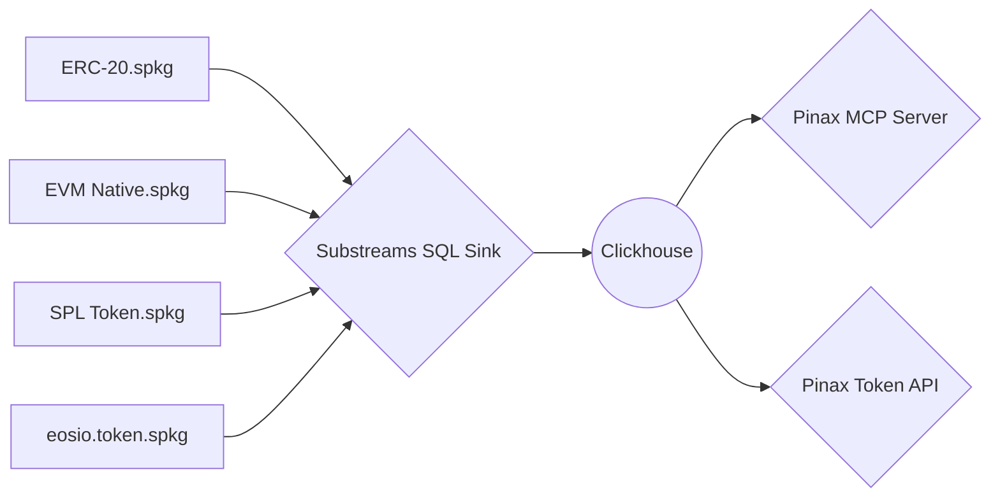

# Pinax: `Token API`

[](https://github.com/pinax-network/pinax-token-api/actions/workflows/bun-test.yml)

> Collection of token-based APIs, covering ERC-20 and native tokens for balances, transfers, and contract data (powered by [Substreams](https://thegraph.com/docs/substreams). **MCP Server** supports multiple chains and token standards, including EVM, Solana, and Antelope.

## Architecture



## Supported Endpoints

### Tokens
- [x] EVM
  - [x] Native
  - [x] ERC-20
- [ ] SVN (Solana)
  - [ ] Native
  - [ ] SPL Token
- [ ] Antelope
  - [ ] Native
  - [ ] eosio.token

### Token Balances
- [x] EVM
- [ ] SVN (Solana)
- [ ] Antelope

### Token Transfers
- [x] EVM
- [ ] SVN (Solana)
- [ ] Antelope

### Token Holders
- [x] EVM
- [ ] SVN (Solana)
- [ ] Antelope

### Token Prices
- [ ] EVM
  - [ ] Uniswap V2
  - [ ] Uniswap V3
  - [ ] CurveFi
  - [ ] SushiSwap
- [ ] SVN (Solana)
  - [ ] Orca
  - [ ] Raydium
- [ ] Antelope
  - [ ] Defibox

### Transactions
- [ ] EVM
- [ ] SVN (Solana)
- [ ] Antelope

### NFTs
- [ ] EVM
- [ ] SVN (Solana)
- [ ] Antelope

## `.env` Environment variables

```env
# Token API Server
PORT=8080
HOSTNAME=localhost

# Bun request timeout in seconds
BUN_IDLE_REQUEST_TIMEOUT=60

# MCP Server
HOST=https://beta.mcp.pinax.network
PINAX_API_KEY="f98f••••••••••••••••••••5247"

# Logging
PRETTY_LOGGING=true
VERBOSE=true
```

## Docker environment

- Pull from GitHub Container registry

**For latest tagged release**

```bash
docker pull ghcr.io/pinax-network/pinax-token-api:latest
```

**For head of `main` branch**

```bash
docker pull ghcr.io/pinax-network/pinax-token-api:develop
```

- Build from source

```bash
docker build \
  --build-arg GIT_COMMIT="$(git rev-parse HEAD)" \
  -t pinax-token-api .
```

- Run with `.env` file

```bash
docker run -it --rm --env-file .env -p 3000:3000 ghcr.io/pinax-network/pinax-token-api:develop
```

## Contributing

See [`CONTRIBUTING.md`](CONTRIBUTING.md).

### Quick start

Install [Bun](https://bun.sh/)

```bash
bun install
bun dev
```

**Tests**

```bash
bun lint
bun test
```
