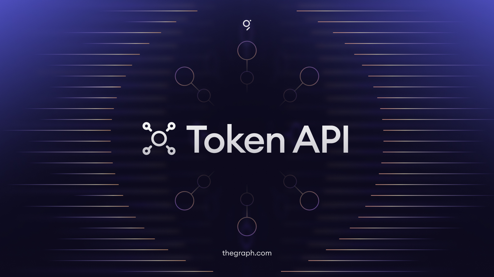

# The Graph: Token API

[](https://github.com/pinax-network/token-api/actions/workflows/bun-test.yml)


### <https://thegraph.com/token-api/>

> Power your apps & AI agents with real-time token data.

📚 **[Documentation](https://thegraph.com/docs/en/token-api/quick-start/)**



## Overview

The Graph’s Token API lets you access blockchain token information via a GET request. This guide is designed to help you quickly integrate the Token API into your application.

The Token API provides access to onchain NFT and fungible token data, including live and historical balances, holders, prices, market data, token metadata, and token transfers. This API also uses the Model Context Protocol (MCP) to allow AI tools such as Claude to enrich raw blockchain data with contextual insights.

## Features

### Token Data

- **Real-time Balances**: Current token holdings for any wallet address
- **Token Transfers**: Historical transfer events with full transaction details
- **Token Metadata**: Symbol, name, decimals, supply, and holder information
- **Price Data**: OHLCV candlestick data and current USD prices

### NFT Support

- **NFT Ownership**: Complete NFT holdings by wallet address
- **Collection Data**: Collection metadata, supply statistics, and holder counts
- **NFT Transfers**: Full NFT transfer history and marketplace activity
- **Sales Data**: NFT marketplace sales with price and transaction details

### DeFi Integration

- **DEX Swaps**: Uniswap and Solana DEX swap events with token amounts
- **Liquidity Pools**: Pool information, token pairs, and trading fees
- **Historical Data**: Time-series data for portfolio tracking and analytics

### Multi-Chain Support

- **EVM Networks**: Ethereum, Base, Arbitrum, BSC, Polygon, Optimism, Avalanche, Unichain
- **SVM Networks**: Solana with full SPL token and DEX swap support
- **Real-time Sync**: Sub-second data latency across all supported networks

## Quick Start

### Prerequisites

- [Bun](https://bun.sh/) (JavaScript runtime)
- [ClickHouse](https://clickhouse.com/) database instance
- Access to blockchain data (via Substreams or data provider)

### Installation

1. **Clone the repository**

   ```bash
   git clone https://github.com/pinax-network/token-api.git
   cd token-api
   ```

2. **Install dependencies**

   ```bash
   bun install
   ```

3. **Configure the database**

   Create a `dbs-config.yaml` file in the root directory:

   ```yaml
   # Token API Database Configuration
   # This file defines the database mappings for each network and data type
   clusters:
     default:
       url: http://127.0.0.1:8123
       username: default
       password: ""

   networks:
     # EVM Networks
     mainnet:
       type: evm
       cluster: default
       transfers: mainnet:evm-transfers@v0.2.2
       balances: mainnet:evm-balances@v0.2.3
       nfts: mainnet:evm-nft-tokens@v0.6.2
       dexes: mainnet:evm-dex@v0.2.6
       contracts: mainnet:evm-contracts@v0.3.0

     # SVM Networks
     solana:
       type: svm
       cluster: default
       transfers: solana:solana-tokens@v0.2.8
       balances: solana:solana-tokens@v0.2.8
       dexes: solana:svm-dex@v0.3.1
   ```

   Then set the path to your config file:

   ```bash
   export DBS_CONFIG_PATH=dbs-config.yaml
   ```

   Or create a `.env` file with optional settings:

   ```env
   # Database Configuration (required)
   DBS_CONFIG_PATH=dbs-config.yaml

   # Logging (optional)
   PRETTY_LOGGING=true
   VERBOSE=true

   # OpenAPI Configuration (optional)
   DISABLE_OPENAPI_SERVERS=false

   # HTTP Cache-Control (optional)
   CACHE_DISABLE=false
   CACHE_SERVER_MAX_AGE=600
   CACHE_MAX_AGE=60
   CACHE_STALE_WHILE_REVALIDATE=30
   ```

4. **Start the development server**

   ```bash
   bun dev
   ```

   The API will be available at `http://localhost:8000`

5. **Explore the API**

   Visit the interactive documentation at `http://localhost:8000/` (when running locally)

### Environment Variables

| Variable | Description | Default | Required |
|----------|-------------|---------|----------|
| `DBS_CONFIG_PATH` | Path to database configuration YAML file | `dbs-config.yaml` | No |
| `PORT` | HTTP server port | `8000` | No |
| `HOSTNAME` | Server hostname | `localhost` | No |
| `IDLE_TIMEOUT` | Connection idle timeout (seconds) | `60` | No |
| `MAX_LIMIT` | Maximum query result limit | `1000` | No |
| `DISABLE_OPENAPI_SERVERS` | Disable OpenAPI server list | `false` | No |
| `CACHE_DISABLE` | Disable HTTP Cache-Control headers entirely | `false` | No |
| `CACHE_SERVER_MAX_AGE` | `s-maxage` for shared/proxy caches (seconds) | `600` | No |
| `CACHE_MAX_AGE` | `max-age` for browser caches (seconds) | `60` | No |
| `CACHE_STALE_WHILE_REVALIDATE` | `stale-while-revalidate` window (seconds, [RFC 5861](https://datatracker.ietf.org/doc/html/rfc5861)) | `30` | No |
| `PRETTY_LOGGING` | Enable pretty console logging | `false` | No |
| `VERBOSE` | Enable verbose logging | `false` | No |

## Caching

The API emits standard HTTP caching headers so responses can be cached by reverse proxies (Caddy, Envoy) and browsers. There are no ClickHouse-level cache settings — all caching is handled via HTTP `Cache-Control` headers, delegating cache storage to your proxy layer.

### Cache-Control Headers

Every successful response from a cached route includes:

```
Cache-Control: public, max-age=60, s-maxage=600, stale-while-revalidate=30
```

| Directive | Purpose |
|-----------|---------|
| `public` | Response can be stored by shared caches (proxies) |
| `max-age` | Browser cache TTL (`CACHE_MAX_AGE`, default 60s) |
| `s-maxage` | Shared/proxy cache TTL — overrides `max-age` for Caddy/Envoy (`CACHE_SERVER_MAX_AGE`, default 600s) |
| `stale-while-revalidate` | Proxy may serve stale for this window while revalidating in the background (`CACHE_STALE_WHILE_REVALIDATE`, default 30s). Defined by [RFC 5861](https://datatracker.ietf.org/doc/html/rfc5861). Caddy supports this via [cache-handler](https://github.com/caddyserver/cache-handler); Envoy does not yet, but the header is future-proof. |

> **Note:** ETag/`If-None-Match` is intentionally omitted. Response bodies include dynamic metadata (`request_time`, `duration_ms`, `statistics`) that change on every request, making content-based ETags ineffective. Time-based caching via `Cache-Control` + proxy `s-maxage` is the appropriate strategy.

### Cache Tiers

*Default (all `/v1/*` routes):* `Cache-Control: public, max-age=1, s-maxage=1` — minimal 1s cache, no `stale-while-revalidate`. Applied globally.

*Extended (specific routes):* Uses the env-configured `CACHE_SERVER_MAX_AGE`, `CACHE_MAX_AGE`, and `CACHE_STALE_WHILE_REVALIDATE` values. Overrides the default on the routes listed below.

| Cached Endpoints |
|-----------------|
| `/v1/*/holders`, `/v1/*/holders/*` |
| `/v1/*/dexes` |
| `/v1/*/tokens`, `/v1/*/tokens/*` |
| `/v1/*/pools`, `/v1/*/pools/ohlc` |
| `/v1/*/transfers`, `/v1/*/transfers/*` |
| `/v1/*/swaps` |
| `/v1/*/balances`, `/v1/*/balances/*` |
| `/v1/*/owner` |
| `/v1/evm/nft/collections`, `/v1/evm/nft/holders`, `/v1/evm/nft/items`, `/v1/evm/nft/ownerships`, `/v1/evm/nft/sales`, `/v1/evm/nft/transfers` |

### Configuration

| Env Variable | Description | Default |
|-------------|-------------|---------|
| `CACHE_DISABLE` | Set to `true` to omit all Cache-Control headers | `false` |
| `CACHE_SERVER_MAX_AGE` | `s-maxage` for shared/proxy caches (seconds) | `600` |
| `CACHE_MAX_AGE` | `max-age` for browser caches (seconds) | `60` |
| `CACHE_STALE_WHILE_REVALIDATE` | `stale-while-revalidate` window (seconds) | `30` |

When a client sends `Cache-Control: no-cache`, the API skips emitting cache headers on the response.

### Proxy Configuration Examples

**Caddy** (with [cache-handler](https://github.com/caddyserver/cache-handler)):

```
{
    order cache before rewrite
    cache
}

token-api.example.com {
    cache
    reverse_proxy localhost:8000
}
```

Caddy's cache-handler respects `s-maxage` and `stale-while-revalidate` out of the box.

**Envoy** (HTTP cache filter):

```yaml
http_filters:
  - name: envoy.filters.http.cache
    typed_config:
      "@type": type.googleapis.com/envoy.extensions.filters.http.cache.v3.CacheConfig
      typed_config:
        "@type": type.googleapis.com/envoy.extensions.http.cache.simple_http_cache.v3.SimpleHttpCacheConfig
```

Envoy's cache filter respects `Cache-Control` directives including `s-maxage` and `max-age`. Note: `stale-while-revalidate` is not yet supported by Envoy's built-in cache ([tracking issue](https://github.com/envoyproxy/envoy/issues/14362)), but the header is emitted for future compatibility and for other proxies in the chain.

## Backend Requirements

### ClickHouse Database

The Token API requires a ClickHouse database instance with the following characteristics:

- **Version**: ClickHouse 22.0+ recommended
- **Memory**: Minimum 4GB RAM for production workloads
- **Storage**: SSD recommended for optimal query performance
- **Network**: Low-latency connection to API server

### Data Pipeline

The API relies on Substreams data pipelines to populate the ClickHouse database.

**Required Substreams packages:**

- **EVM Tokens**: [substreams-evm-tokens](https://github.com/pinax-network/substreams-evm-tokens) - ERC-20 token data, transfers, and NFT information
- **Solana Tokens**: [substreams-solana](https://github.com/pinax-network/substreams-solana) - SPL token data, transfers, and DEX swap events

## Authentication

The API uses Bearer token authentication. For the live endpoint (token-api.thegraph.com), you can get your API token at [The Graph Market](https://thegraph.market).
Head over <https://thegraph.com/docs/en/token-api/quick-start/#authentication> for more information.

```bash
curl -H "Authorization: Bearer <YOUR_API_TOKEN>" \
  "..."
```

## Supported Networks

> [!TIP]
>
> Checkout the [`networks-registry`](https://github.com/graphprotocol/networks-registry) repository for reference.

### EVM Networks

- **Ethereum Mainnet** (`mainnet`)
- **Arbitrum One** (`arbitrum-one`)
- **Avalanche C-Chain** (`avalanche`)
- **Base** (`base`)
- **BNB Smart Chain** (`bsc`)
- **Polygon** (`matic`)
- **Optimism** (`optimism`)
- **Unichain** (`unichain`)

### SVM Networks

- **Solana Mainnet** (`solana`)

## Docker Deployment

### Using Pre-built Images

**Latest stable release:**

```bash
docker pull ghcr.io/pinax-network/token-api:latest
docker run -it --rm \
  -v $(pwd)/dbs-config.yaml:/dbs-config.yaml \
  -e DBS_CONFIG_PATH=/dbs-config.yaml \
  -p 8000:8000 \
  ghcr.io/pinax-network/token-api:latest
```

**Development build:**

```bash
docker pull ghcr.io/pinax-network/token-api:develop
docker run -it --rm \
  -v $(pwd)/dbs-config.yaml:/dbs-config.yaml \
  -e DBS_CONFIG_PATH=/dbs-config.yaml \
  -p 8000:8000 \
  ghcr.io/pinax-network/token-api:develop
```

### Building from Source

```bash
docker build -t token-api .
docker run -it --rm \
  -v $(pwd)/dbs-config.yaml:/dbs-config.yaml \
  -e DBS_CONFIG_PATH=/dbs-config.yaml \
  -p 8000:8000 \
  token-api
```

## Development

### Running Tests

```bash
bun test        # Run test suite
bun lint        # Run linting
bun fix         # Fix linting and formatting issues
```

### Query Schema Conventions

Route query parameters are defined using `createQuerySchema()` with `FieldConfig` objects. Each field can be:

- **Required** — no flag, user must provide a value (e.g. `network`, `contract` in holders)
- **Optional** — `optional: true`, field defaults to `null` (scalar) or `[]` (batched array). No filter applied when absent.
- **Default** — `default: <value>`, field uses a specific default value (e.g. `default: false` for `include_null_balances`)
- **Prefault** — `prefault: <value>`, default applied at input level before parsing (e.g. `prefault: '1d'` for `interval`)

```ts
const querySchema = createQuerySchema({
    // Required field — user must provide
    network: { schema: evmNetworkIdSchema },
    // Optional batched field — defaults to [] (no filter)
    contract: { schema: evmContractSchema, batched: true, optional: true },
    // Optional scalar field — defaults to null (no filter)
    start_time: { schema: timestampSchema, optional: true },
});
```

**SQL conventions for optional parameters:**

- **Array params**: Use `empty()` / `notEmpty()` to check if filter is active
- **Scalar params**: Use `Nullable()` type with `isNull()` guard

```sql
-- Array: skip filter when empty
AND (empty({contract:Array(String)}) OR contract IN {contract:Array(String)})
-- Scalar: skip filter when null
AND (isNull({start_time:Nullable(UInt64)}) OR timestamp >= {start_time:Nullable(UInt64)})
```

### Project Structure

```
token-api/
├── src/
│   ├── routes/          # API route handlers (colocated .ts + .sql)
│   ├── types/           # Zod schemas and TypeScript types
│   ├── clickhouse/      # ClickHouse client configuration
│   ├── services/        # Shared services (indexed tip, etc.)
│   └── sql/             # SQL utilities
├── public/              # Static assets
└── index.ts             # Application entry point
```

## Contributing

We welcome contributions! Please see our [Contributing Guidelines](CONTRIBUTING.md) for details.

### Development Workflow

1. Fork the repository
2. Create a feature branch
3. Make your changes
4. Add tests for new functionality
5. Run the test suite
6. Lint `bun lint` and fix if needed `bun fix`
7. Submit a pull request

## License

This project is licensed under the [Apache License 2.0](LICENSE).

## Support

- **Documentation**: [API Docs](https://thegraph.com/token-api/)
- **Issues**: [GitHub Issues](https://github.com/pinax-network/token-api/issues)
- **Community**: [The Graph Discord](https://discord.gg/thegraph)
